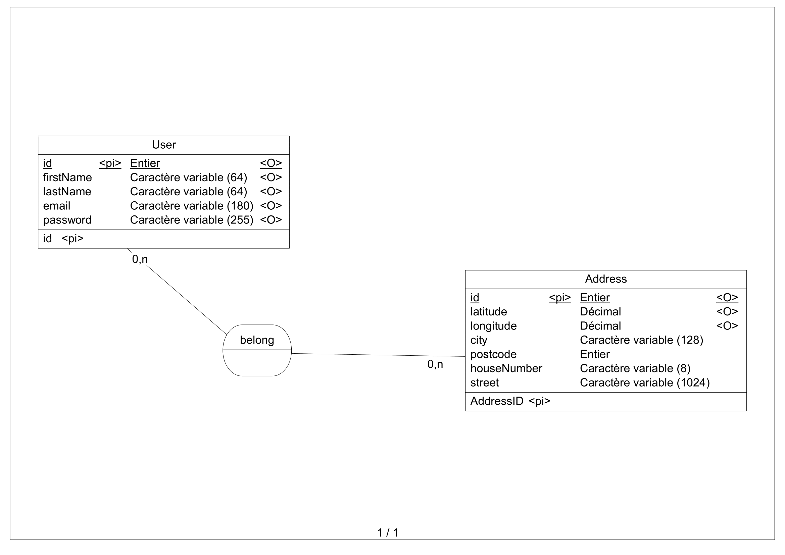
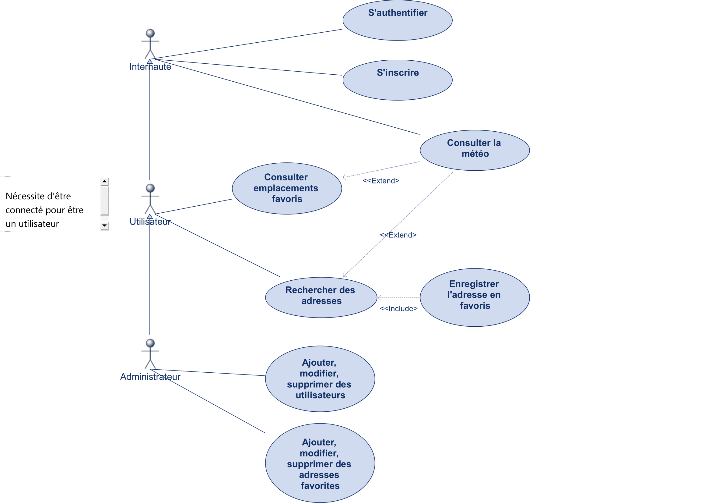

# MétéoExpress

## Auteurs

- [Pierre Gouedar](https://www.github.com/pierregouedar)

## Sommaire 

- [Description de la réalisation du projet](#description-de-la-réalisation-du-projet)
- [Réalisations annexes](#réalisations-annexes)
  
  - [MCD](#mcd-)
  - [UC](#diagramme-de-cas-dutilisation-use-case)
- [Installation](#installation)
- [Utilisation](#utilisation)

## Description de la réalisation du projet

- Composants symfony utilisés :

    - EasyAdmin
    - Foundry

- Outils utilisés :

    - PhpStorm
    - Git

- Difficultés rencontrées :

    - Problème de conflits entre les versions des composants symfony installés

## Réalisations annexes

### MCD 



### Diagramme de cas d'utilisation (use-case)



## Installation

- Avant d'installer ce projet, veuillez créer une copie du fichier `.env` en `.env.local` et configurer une base de données MySQL dans ce fichier en éditant la ligne : `DATABASE_URL="mysql://!user!:!password!@!IP!:3306/!DB_Name!?serverVersion=mariadb-10.2.25" `

- Assurez-vous également d'avoir PHP (version 8.1 et ultérieure) et Composer pour pouvoir installer le projet.

Pour installer les dépendances nécessaires au projet, exécutez la commande suivante :

```bash
  composer install
```

Pour initialiser automatiquement votre base de données, exécutez la commande suivante :
```bash
    composer db
```

Ensuite pour lancer le projet, exécutez la commande suivante :
```bash
    symfony serve
```
## Utilisation

Lors de l'initialisation de la base de données deux comptes utilisateur sont créé :


- E-mail : root@example.com
- Mot de passe : default
- Rôle : Administrateur

---

- E-mail : user@example.com
- Mot de passe : default
- Rôle : utilisateur

Avec le compte administrateur, vous avez accès au panneau d'administration de l'application vous permettant d'ajouter manuellement des utilisateur et des adresses. 